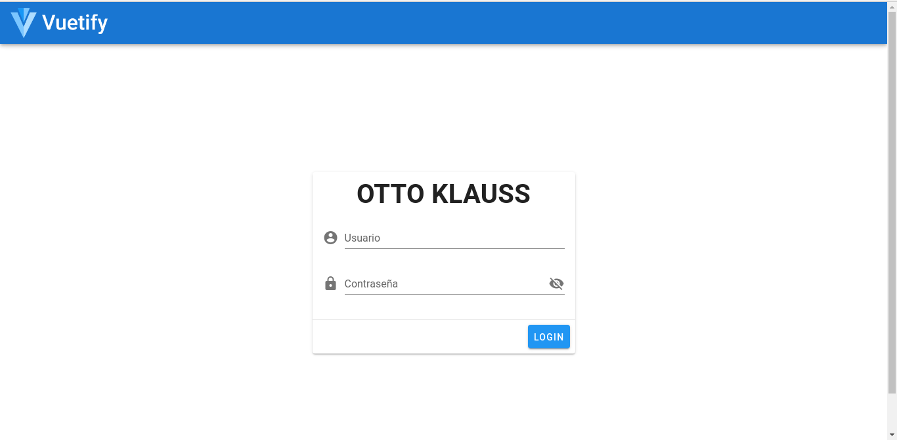
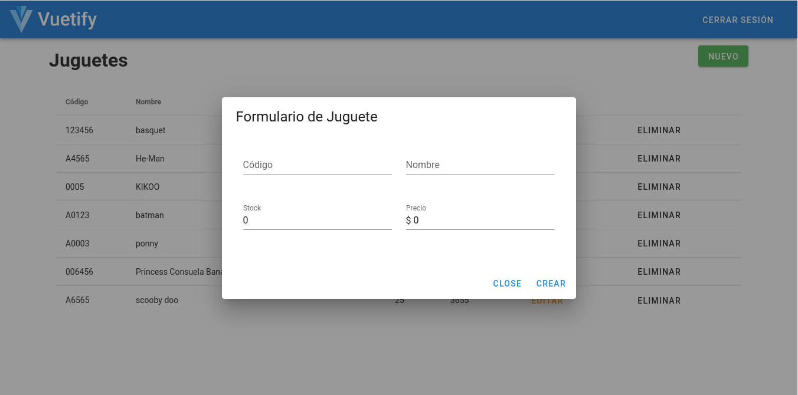

# 0049-Ottoklauss

Proyecto CRUD con Vue, Vuex, Router y Firebase. Para ver el proyecto en producción siga el siguiente [enlace](https://ottoklauss-5927c.web.app/)

## Crecenciales de prueba
user: usuario_de_prueba@test.org

pass: testtest

## Project setup
```
npm install
```

### Compiles and hot-reloads for development
```
npm run serve
```

### Compiles and minifies for production
```
npm run build
```

### Lints and fixes files
```
npm run lint
```

### Imágenes referenciales

Interfáz de inicio de sesión:


Formulario para crear/editar


